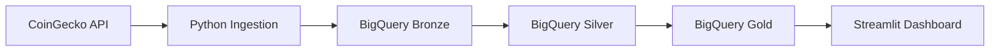

# ☁️ Cloud Data Pipeline: CoinGecko → BigQuery


---

## 📌 Visão Geral

Este projeto implementa um **pipeline de Engenharia de Dados end-to-end**, responsável por consumir dados da API pública da **CoinGecko**, realizar ingestão em nuvem e estruturar os dados seguindo a **Arquitetura Medalhão (Bronze, Silver e Gold)** no **Google BigQuery**.

O foco principal é demonstrar:

- Boas práticas de **engenharia analítica**
- Uso de **ELT em Data Warehouse**
- **Qualidade, rastreabilidade e observabilidade dos dados**
- Aplicação de **métricas financeiras reais** para análise do mercado cripto

---

## 🏗️ Arquitetura da Solução

O pipeline segue o padrão **ELT (Extract, Load, Transform)**, priorizando o BigQuery para transformações analíticas pesadas e escaláveis.



### 🧩 Detalhamento das Etapas do Pipeline

A arquitetura foi desenhada para garantir **idempotência, rastreabilidade e performance**. Cada camada do Data Warehouse cumpre um papel específico na governança do dado:

#### 📥 1. Camada Bronze (Raw Data)
*Responsável pela ingestão bruta e histórico imutável.*
- **Fonte:** Extração automatizada via Script Python (`requests`).
- **Destino:** Tabela particionada no BigQuery.
- **Estratégia:** *Append-Only*. Todo dado recebido é gravado com um carimbo de tempo (`ingestion_timestamp`), permitindo auditoria completa e reprocessamento histórico caso necessário.

#### 🛠️ 2. Camada Silver (Cleansed & Refined)
*Responsável pela limpeza, deduplicação e padronização.*
- **Tecnologia:** SQL (BigQuery Views).
- **Transformações:**
  - Remoção de duplicatas utilizando **Window Functions** (`ROW_NUMBER()`).
  - Conversão de tipos de dados (Casting) para formatos nativos do BigQuery.
  - Tratamento de valores nulos e *Data Quality Checks* básicos.
- **Resultado:** Dados confiáveis e prontos para análise granular.

#### 🏆 3. Camada Gold (Business Aggregates)
*Responsável pelas métricas de negócio e KPIs.*
- **Foco:** Performance analítica.
- **Lógica:** Agregações diárias para responder perguntas de negócio.
- **Métricas Geradas:**
  - Preço Médio Diário (VWAP simplificado).
  - Volatilidade Intraday (Min/Max).
  - Volumetria de registros (Monitoramento de consistência).

#### 📊 4. Visualização (Data Viz)
*Interface final para stakeholders e tomada de decisão.*
- **Ferramenta:** **Streamlit** (Python).
- **Funcionalidade:** Conecta diretamente à camada **Gold** do BigQuery para plotar gráficos de tendência e tabelas analíticas, democratizando o acesso aos dados processados.

---


## 🚀 Diferenciais Técnicos

O projeto adota práticas modernas de Engenharia de Dados:

* ✅ **Arquitetura ELT:** Processamento pesado delegado ao *engine* do BigQuery, reduzindo custos de computação local.
* ✅ **Governança de Dados:** Separação lógica clara entre dados brutos, tratados e refinados.
* ✅ **Idempotência:** O pipeline pode ser executado múltiplas vezes sem duplicar dados na visão final.
* ✅ **Cloud Native:** Utilização de serviços gerenciados (Serverless) para escalabilidade automática.

---

## 🛠️ Stack Tecnológico

| Categoria | Tecnologia | Uso no Projeto |
| :--- | :--- | :--- |
| **Linguagem** |  | Script de extração e App de Visualização |
| **Cloud** |  | Plataforma de Nuvem |
| **Warehouse** |  | Armazenamento e Processamento SQL |
| **Dashboard** |  | Front-end de Dados |
| **Controle** |  | Versionamento de Código |

---

## 📈 Insights de Negócio

Além da engenharia, o projeto entrega valor analítico respondendo a perguntas como:
1.  *Qual a tendência de preço do Bitcoin nos últimos 30 dias?*
2.  *Qual foi a volatilidade (diferença entre mínima e máxima) de ontem?*
3.  *O pipeline de dados sofreu alguma queda de volumetria recentemente?*

---

## ⚙️ Como Executar Localmente


```bash
# 1. Clone o repositório
git clone [https://github.com/Henrique416148/cloud-data-pipeline.git](https://github.com/Henrique416148/cloud-data-pipeline.git)

# 2. Instale as dependências
pip install -r requirements.txt

# 3. Configure as credenciais do GCP (Service Account)
export GOOGLE_APPLICATION_CREDENTIALS="path/to/your/key.json"

# 4. Execute a ingestão
python src/ingestion.py

# 5. (Opcional) Rode o dashboard
streamlit run src/app.py
```

👋 Sobre Mim
<div align="center"> <h2>Luis Henrique</h2> <h4>Data Engineer | Analytics | Cloud</h4> <p><em>"Transformando dados brutos em insights acionáveis através de engenharia robusta."</em></p> <p> <a href="https://linkedin.com/in/luis-henrique-dos-ribeiro-991aa8250">  </a> </p> </div> ```
