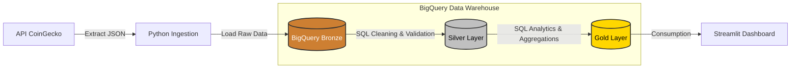

# ☁️ Cloud Data Pipeline: CoinGecko → BigQuery

---

## 📌 Visão Geral

Este projeto implementa um **pipeline de Engenharia de Dados end-to-end**, responsável por consumir dados da API pública da **CoinGecko**, realizar ingestão em nuvem e estruturar os dados seguindo a **Arquitetura Medalhão (Bronze, Silver e Gold)** no **Google BigQuery**.

O foco principal do projeto é demonstrar:
- Boas práticas de **engenharia analítica**
- Uso de **ELT em Data Warehouse**
- **Qualidade e observabilidade dos dados**
- Aplicação de **métricas financeiras reais** para análise de mercado cripto

---

## 🏗️ Arquitetura da Solução

O pipeline segue o padrão **ELT (Extract, Load, Transform)**, priorizando o BigQuery para transformações pesadas e escaláveis.

### 1. Monitoramento de SLA (Data Quality)

🧱 Camadas de Dados (Medallion)
🟤 Bronze — Raw

Dados exatamente como retornados pela API.

Schema mínimo e metadados: asset_id, currency, price, price_timestamp, ingestion_timestamp, run_id, source.

if_exists='append' para preservar histórico.

⚪ Silver — Curado (View)

Deduplicação (ex.: ROW_NUMBER() por asset_id, currency, price_timestamp ordenando por ingestion_timestamp DESC).

Padronização (casing, tipos, UTC).

Validações básicas (price > 0).

🟡 Gold — Agregado (Tabela)

Agregações prontas para consumo (diárias / horárias).

Indicadores financeiros (média móvel 7d, volatilidade 7d, price close).

Tabela materializada / particionada para performance.

### 2. Entrega da Camada Gold (Business Intelligence)

📈 Observabilidade & Data Quality (exemplos)

SLA de ingestão: meta de 24 coletas/dia. Validar counts por dia.

Checks principais: price NULL, price <= 0, timestamps nulos, lacunas por dia.

Auditoria: run_id e ingestion_timestamp para reprocessamento / investigação.

🧭 Como Rodar o Projeto (exemplo rápido)

Pré-requisitos: Python 3.9+, gcloud CLI autenticado, conta GCP com BigQuery habilitado.

# 1. Clone o repositório:

git clone https://github.com/Henrique416148/cloud-data-pipeline.git
cd cloud-data-pipeline

# 2. Crie um ambiente virtual e instale as dependências:

`python -m venv .venv
source .venv/bin/activate`  
# macOS / Linux
`.venv\Scripts\activate`    
# Windows
`pip install -r requirements.txt`

# 3. Configure credenciais:

Crie um Service Account no GCP com permissão para BigQuery.

Baixe a chave JSON e adicione em `.gitignore`

Exporte a variável de ambiente:

`export GOOGLE_APPLICATION_CREDENTIALS="/path/to/service_account.json"`

# 4. Rodar a ingestão local (exemplo):

`python ingest_btc.py`

# 5. Validar dados no BigQuery:

SELECT COUNT(*) FROM `seu-projeto.raw_data.bitcoin_prices_bronze`;

✅ Boas práticas demonstradas

Separação de responsabilidades entre ingestão (Python) e transformação (BigQuery SQL)

Uso de IDs de execução (run_id) e ingestion_timestamp para rastreabilidade

Deduplicação na Silver via ROW_NUMBER() e QUALIFY

Documentação clara e orientada a produto

📂 Repositórios & Links

Repositório principal: https://github.com/Henrique416148/cloud-data-pipeline

👋 Sobre Mim

 <h2>Luis Henrique</h2> <h4>Data Engineer | Analytics | Cloud</h4> 
<em>"Transformando dados brutos em insights acionáveis através de engenharia robusta."</em>
 
  
 

