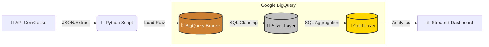
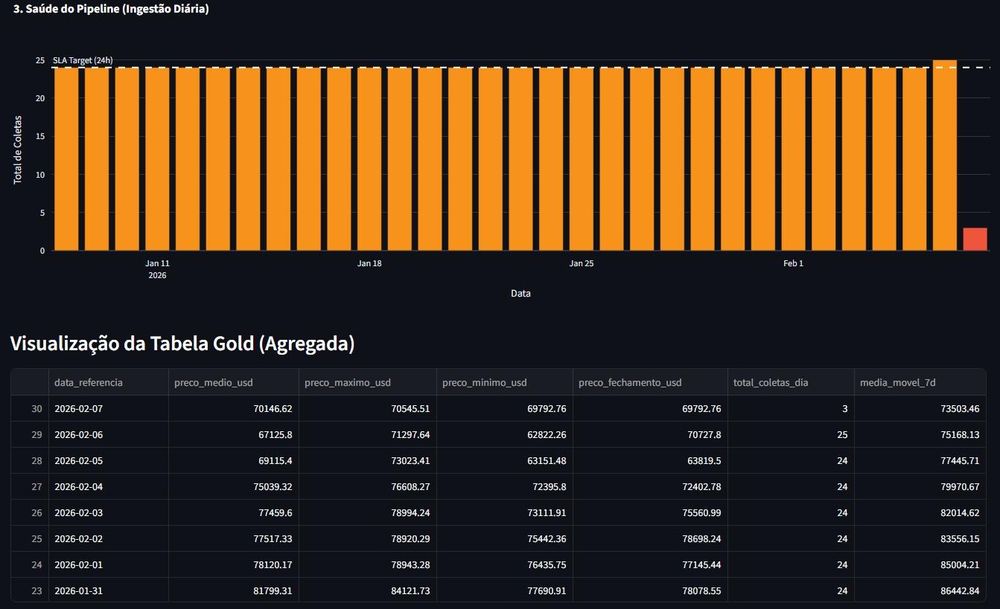
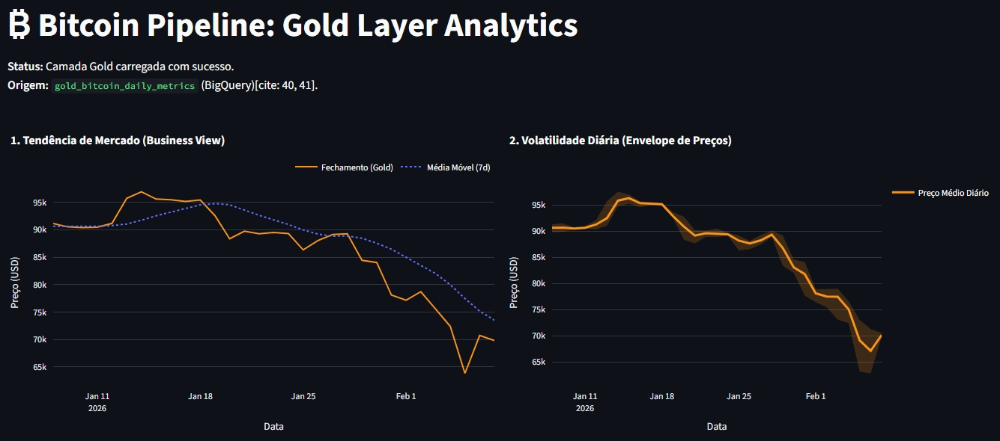

# ☁️ Cloud Data Pipeline: CoinGecko to BigQuery

## 📋 Visão Geral do Projeto
Este projeto consiste em um pipeline de Engenharia de Dados **end-to-end** que consome dados da API pública da **CoinGecko**, realiza a ingestão em nuvem e estrutura os dados utilizando a **Arquitetura Medalhão (Bronze, Silver e Gold)** no Google BigQuery.

O diferencial estratégico deste ecossistema é a implementação de **Data Quality (SLA)** e indicadores financeiros avançados, como médias móveis e envelopes de preço, calculados diretamente no Data Warehouse.

---

## 🏗️ Arquitetura da Solução
O pipeline segue o padrão **ELT (Extract, Load, Transform)**, priorizando a performance do BigQuery para transformações pesadas.

📈 Resultados e Observabilidade
1. Monitoramento de SLA (Data Quality)
O pipeline utiliza um monitor de SLA (Service Level Agreement) que valida se o alvo de 24 coletas diárias foi atingido.

Auditoria Visual: O sistema identifica falhas de ingestão (barras fora do padrão), permitindo a correção imediata do fluxo.

2. Entrega da Camada Gold (Business Intelligence)
A Camada Gold (gold_bitcoin_daily_metrics) consolida os dados para o usuário final, calculando métricas de tendência e volatilidade.

Métricas: Inclui Preço de Fechamento, Média Móvel (7d) e Envelope de Preços.

<h1>Hi there, I'm Luis Henrique 👋</h1>
<h3>Data Engineer | Analytics | Cloud</h3>

<em>"Transformando dados brutos em insights acionáveis através de engenharia robusta."</em>

🛠️ Diferenciais Técnicos
Arquitetura Medallion: Separação clara entre dados brutos e curados.

SQL Analytics: Uso de Window Functions para análise de séries temporais.

Observabilidade: Foco total em qualidade e disponibilidade do dado.

### 1. Monitoramento de SLA (Data Quality)

### 2. Entrega da Camada Gold (Business Intelligence)

